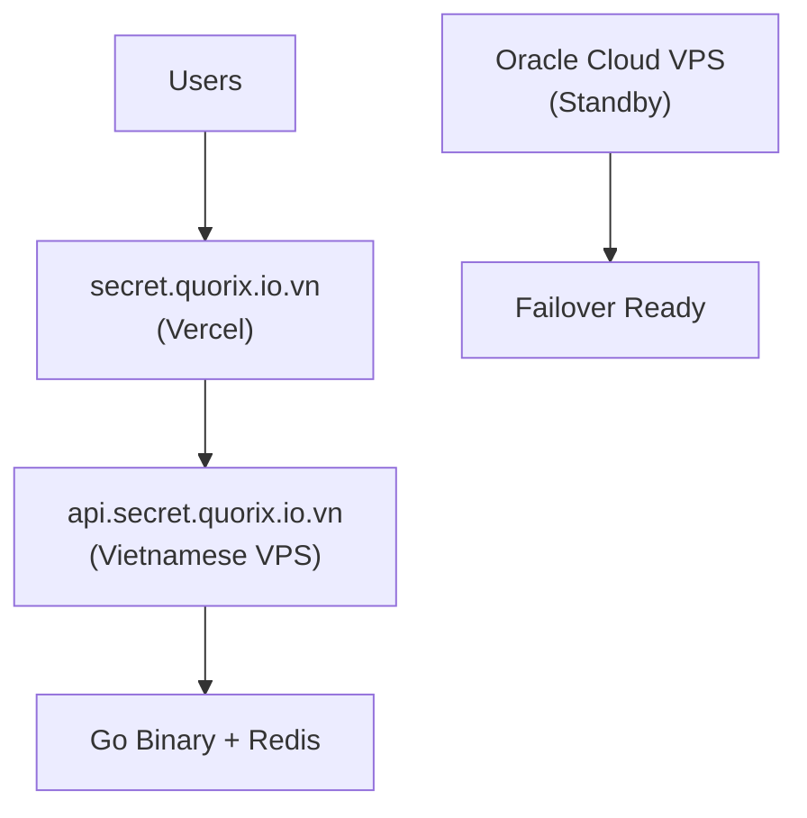

# One-Time Link Documentation

This directory contains the complete documentation for the one-time-link application, a secure secret sharing service designed for portfolio demonstration and learning.

## 📋 Documentation Overview

### Product Specification
- **[Requirements](product-spec/one-time-link-requirements.md)** - Complete functional and security requirements
- **[Architecture](product-spec/one-time-link-architecture.md)** - System design and technology decisions  
- **[Milestones](product-spec/one-time-link-milestones.md)** - Implementation roadmap with learning objectives

### API and Contracts
- **[Public HTTP API](contracts/public-http-api.md)** - Complete API specification for frontend-backend communication

### Deployment and Operations
- **[Deployment Guide](deployment/deployment-guide.md)** - Complete deployment strategy and procedures
- **[Legacy Docs](deployment/)** - Original Vietnamese deployment documentation (archived)

## 🎯 Project Goals

**Primary Objectives:**
- Create a working portfolio piece demonstrating full-stack development
- Learn modern web security practices (client-side encryption, preview bot protection)
- Gain experience with production deployment and operations
- Build something useful that can be publicly demonstrated

**Technical Focus:**
- **Security**: Client-side encryption, atomic operations, HTTPS-only
- **Reliability**: Race condition prevention, failover capabilities
- **Simplicity**: Single VPS deployment with clear upgrade path
- **Learning**: Each milestone teaches specific technical skills

## 🏗️ Architecture Summary



**Key Decisions:**
- **Frontend**: React + TypeScript on Vercel (leveraging existing domain)
- **Backend**: Single Go binary with internal service boundaries
- **Database**: Self-hosted Redis for TTL and atomic operations
- **Deployment**: Primary VPS (Vietnam) + Standby (Oracle Cloud)
- **Security**: AES-GCM client-side encryption, fragment-based key distribution

## 🔐 Security Model

**Core Principles:**
1. **Server Never Sees Plaintext**: All encryption happens in browser
2. **Atomic Consumption**: Redis GETDEL prevents race conditions  
3. **Preview Bot Protection**: Explicit user interaction required
4. **Minimal Retention**: Secrets deleted immediately after reveal
5. **Transport Security**: HTTPS-only with security headers

**Threat Model:**
- ✅ Database compromise (only ciphertext exposed)
- ✅ Preview bots consuming secrets
- ✅ Race conditions in concurrent reveals
- ✅ Man-in-the-middle attacks (HTTPS + HSTS)
- ⚠️ Client-side compromise (inherent limitation)
- ⚠️ Social engineering (user education required)

## 📊 Implementation Status

### ✅ Milestone 1: Foundation and Local Development (COMPLETE)
**Completed:** 2026-04-14

- ✅ Monorepo structure with clear boundaries
- ✅ React + TypeScript frontend shell with Vite
- ✅ Go backend with HTTP routing and middleware
- ✅ Local Redis via Docker Compose
- ✅ API contract documentation
- ✅ Health endpoints and structured logging
- ✅ Request ID tracking and CORS middleware
- ✅ Request size limiting (15KB)
- ✅ IP/UA hashing in logs

**Documentation:** [MILESTONE_1_COMPLETION.md](MILESTONE_1_COMPLETION.md)

### ✅ Milestone 2: Client-Side Encryption and Secret Creation (COMPLETE)
**Completed:** 2026-04-15

**Backend:**
- ✅ POST /api/secrets endpoint
- ✅ Redis service with TTL auto-expiration
- ✅ Comprehensive validation (algorithm, TTL, nonce, ciphertext)
- ✅ Error handling (400, 413, 500, 201)
- ✅ UUID generation for secret IDs
- ✅ 81.5% test coverage for httpapi

**Frontend:**
- ✅ AES-GCM 256-bit encryption with Web Crypto API
- ✅ 12-byte nonce generation
- ✅ Base64url encoding (RFC 4648)
- ✅ Create secret form with TTL selection
- ✅ Secret link generation with key in URL fragment
- ✅ Copy to clipboard functionality

**Testing:**
- ✅ 20+ test cases
- ✅ ~70% overall coverage
- ✅ Integration tests
- ✅ Manual test scripts

**Quality:**
- ✅ Code quality: 9.0/10
- ✅ Security: 10/10
- ✅ Specs compliance: 100%

**Documentation:** 
- [MILESTONE_2_COMPLETION.md](MILESTONE_2_COMPLETION.md) - Complete report
- [MILESTONE_2_QUICK_REFERENCE.md](MILESTONE_2_QUICK_REFERENCE.md) - Quick guide

### 📋 Upcoming Milestones

**Milestone 3: Secret Reveal and Consumption (NEXT)**
- [ ] GET /api/secrets/{id}/status endpoint
- [ ] POST /api/secrets/{id}/consume endpoint
- [ ] Reveal page component
- [ ] Client-side decryption
- [ ] Already-used state tracking

**Milestone 4: Atomic Consumption and Race Prevention**
- [ ] Redis GETDEL atomic operations
- [ ] Rate limiting implementation
- [ ] Concurrent request handling

**Milestone 5: Production Deployment**
- [ ] Vietnamese VPS setup
- [ ] Oracle Cloud standby
- [ ] HTTPS and security headers
- [ ] Vercel frontend deployment

**Milestone 6: Operational Excellence**
- [ ] Failover procedures
- [ ] Monitoring and alerting
- [ ] Performance optimization

## 🚀 Quick Start

### Local Development
```bash
# Start Redis
docker compose -f deploy/local/docker-compose.yml up -d

# Run backend
go run ./backend/cmd/api

# Run frontend  
cd frontend/web-app && npm run dev
```

### Production Deployment
See [Deployment Guide](deployment/deployment-guide.md) for complete instructions.

## 📚 Learning Objectives

This project is designed to teach:

**Backend Development:**
- Go HTTP servers and middleware patterns
- Redis operations and atomic commands
- Concurrency and race condition prevention
- API design and error handling
- Production deployment and monitoring

**Frontend Development:**
- React + TypeScript best practices
- Web Crypto API for client-side encryption
- Secure URL handling and fragment keys
- Error state management and UX design
- Production build and deployment

**Security Engineering:**
- Client-side encryption implementation
- Preview bot protection strategies
- Rate limiting and abuse prevention
- HTTPS configuration and security headers
- Threat modeling and risk assessment

**Operations:**
- Linux server administration
- DNS management and failover
- Monitoring and logging strategies
- Incident response procedures
- Cost-effective deployment strategies

## 🎓 Educational Value

**For Portfolio:**
- Demonstrates full-stack development skills
- Shows security-conscious design thinking
- Proves ability to deploy and operate real systems
- Illustrates trade-off analysis and decision making

**For Interviews:**
- Concrete examples of security implementation
- Discussion of scalability and reliability patterns
- Demonstration of operational thinking
- Evidence of learning and growth mindset

## 📖 Documentation Standards

**All documentation follows these principles:**
- **Implementable**: Specific enough to code from
- **Consistent**: No contradictions between documents
- **Complete**: Covers all aspects from requirements to operations
- **Clear**: Technical but accessible language
- **Current**: Reflects actual implementation decisions

**Document Relationships:**
- Requirements → Architecture → API Contract → Implementation
- Architecture → Deployment Guide → Operational Procedures
- Milestones → All other documents (implementation roadmap)

## 🔄 Document Maintenance

**When to Update:**
- Requirements change or clarification needed
- Architecture decisions evolve
- API contract modifications
- Deployment procedures change
- New security considerations identified

**Update Process:**
1. Identify affected documents
2. Update all related documentation
3. Verify consistency across documents
4. Test procedures if operational changes
5. Update this README if structure changes

## 📞 Support and Questions

**For Implementation Questions:**
- Check API contract for endpoint specifications
- Review architecture document for design decisions
- Consult milestones for implementation order

**For Deployment Issues:**
- Follow deployment guide step-by-step
- Check security checklist for hardening
- Review failover procedures for reliability

**For Security Concerns:**
- Review security requirements and threat model
- Check implementation against security checklist
- Consider additional hardening measures

This documentation set provides everything needed to understand, implement, deploy, and operate the one-time-link application successfully.
