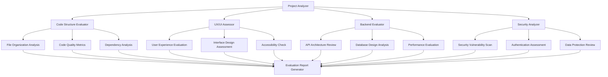
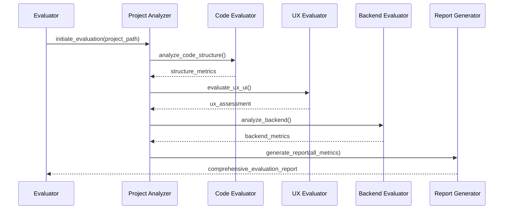

# Design Document: Project Evaluation System

## Overview

Thiết kế một hệ thống đánh giá dự án toàn diện cho "one-time-link" - một ứng dụng hiện tại chỉ là build tool TypeScript đơn giản nhưng cần được phát triển thành một ứng dụng web hoàn chỉnh cho việc tạo và quản lý các liên kết một lần sử dụng. Hệ thống đánh giá sẽ phân tích các khía cạnh UX/UI, backend architecture, cấu trúc dự án, và đưa ra khuyến nghị cải thiện cụ thể.

## Architecture



## Sequence Diagrams

### Main Evaluation Flow



## Components and Interfaces

### Component 1: Project Analyzer

**Purpose**: Orchestrates the overall evaluation process and coordinates between different evaluation modules

**Interface**:
```pascal
INTERFACE ProjectAnalyzer
  PROCEDURE analyzeProject(projectPath: String): EvaluationResult
  PROCEDURE loadProjectMetadata(path: String): ProjectMetadata
  PROCEDURE coordinateEvaluators(): EvaluationMetrics
END INTERFACE
```

**Responsibilities**:
- Khởi tạo và điều phối quá trình đánh giá
- Thu thập metadata của dự án
- Tổng hợp kết quả từ các module đánh giá khác nhau

### Component 2: Code Structure Evaluator

**Purpose**: Đánh giá cấu trúc code, tổ chức file, và chất lượng code

**Interface**:
```pascal
INTERFACE CodeStructureEvaluator
  PROCEDURE analyzeFileOrganization(projectPath: String): OrganizationMetrics
  PROCEDURE evaluateCodeQuality(files: Array[String]): QualityMetrics
  PROCEDURE analyzeDependencies(packageFiles: Array[String]): DependencyMetrics
END INTERFACE
```

**Responsibilities**:
- Phân tích cấu trúc thư mục và tổ chức file
- Đánh giá chất lượng code (complexity, maintainability)
- Kiểm tra dependencies và potential vulnerabilities

### Component 3: UX/UI Assessor

**Purpose**: Đánh giá trải nghiệm người dùng và thiết kế giao diện

**Interface**:
```pascal
INTERFACE UXUIAssessor
  PROCEDURE evaluateUserExperience(frontendPath: String): UXMetrics
  PROCEDURE assessInterfaceDesign(uiComponents: Array[Component]): UIMetrics
  PROCEDURE checkAccessibility(htmlFiles: Array[String]): AccessibilityScore
END INTERFACE
```

**Responsibilities**:
- Đánh giá user journey và usability
- Kiểm tra responsive design và cross-browser compatibility
- Đánh giá accessibility compliance

### Component 4: Backend Evaluator

**Purpose**: Đánh giá kiến trúc backend, API design, và performance

**Interface**:
```pascal
INTERFACE BackendEvaluator
  PROCEDURE analyzeAPIArchitecture(apiFiles: Array[String]): APIMetrics
  PROCEDURE evaluateDatabase(dbSchema: DatabaseSchema): DBMetrics
  PROCEDURE assessPerformance(endpoints: Array[Endpoint]): PerformanceMetrics
END INTERFACE
```

**Responsibilities**:
- Đánh giá RESTful API design và documentation
- Kiểm tra database schema và query optimization
- Đánh giá performance và scalability

## Data Models

### Model 1: EvaluationResult

```pascal
STRUCTURE EvaluationResult
  projectName: String
  evaluationDate: DateTime
  overallScore: Float
  codeStructureScore: CodeStructureMetrics
  uxuiScore: UXUIMetrics
  backendScore: BackendMetrics
  securityScore: SecurityMetrics
  recommendations: Array[Recommendation]
END STRUCTURE
```

**Validation Rules**:
- overallScore phải trong khoảng 0.0 đến 10.0
- evaluationDate không được null
- Tất cả score components phải có giá trị hợp lệ

### Model 2: CodeStructureMetrics

```pascal
STRUCTURE CodeStructureMetrics
  fileOrganizationScore: Float
  codeQualityScore: Float
  dependencyHealthScore: Float
  testCoverageScore: Float
  documentationScore: Float
  issues: Array[CodeIssue]
END STRUCTURE
```

**Validation Rules**:
- Tất cả score phải trong khoảng 0.0 đến 10.0
- issues array có thể rỗng nhưng không được null

### Model 3: UXUIMetrics

```pascal
STRUCTURE UXUIMetrics
  userExperienceScore: Float
  interfaceDesignScore: Float
  accessibilityScore: Float
  responsivenessScore: Float
  usabilityIssues: Array[UsabilityIssue]
  designRecommendations: Array[DesignRecommendation]
END STRUCTURE
```

### Model 4: BackendMetrics

```pascal
STRUCTURE BackendMetrics
  apiDesignScore: Float
  databaseDesignScore: Float
  performanceScore: Float
  scalabilityScore: Float
  securityScore: Float
  architectureIssues: Array[ArchitectureIssue]
END STRUCTURE
```

## Algorithmic Pseudocode

### Main Evaluation Algorithm

```pascal
ALGORITHM evaluateProject(projectPath)
INPUT: projectPath of type String
OUTPUT: result of type EvaluationResult

BEGIN
  ASSERT projectPath IS NOT NULL AND projectPath IS NOT EMPTY
  
  // Step 1: Initialize evaluation context
  context ← initializeEvaluationContext(projectPath)
  metadata ← loadProjectMetadata(projectPath)
  
  // Step 2: Perform multi-dimensional evaluation
  codeMetrics ← evaluateCodeStructure(projectPath, metadata)
  uxuiMetrics ← evaluateUXUI(projectPath, metadata)
  backendMetrics ← evaluateBackend(projectPath, metadata)
  securityMetrics ← evaluateSecurity(projectPath, metadata)
  
  // Step 3: Calculate overall score with weighted average
  overallScore ← calculateWeightedScore(codeMetrics, uxuiMetrics, backendMetrics, securityMetrics)
  
  // Step 4: Generate recommendations
  recommendations ← generateRecommendations(codeMetrics, uxuiMetrics, backendMetrics, securityMetrics)
  
  // Step 5: Create comprehensive result
  result ← createEvaluationResult(overallScore, codeMetrics, uxuiMetrics, backendMetrics, securityMetrics, recommendations)
  
  ASSERT result.overallScore >= 0.0 AND result.overallScore <= 10.0
  ASSERT result.recommendations IS NOT NULL
  
  RETURN result
END
```

**Preconditions:**
- projectPath must be a valid directory path
- Project directory must be accessible and readable
- Required evaluation tools and dependencies must be available

**Postconditions:**
- Returns complete EvaluationResult with all metrics calculated
- Overall score is within valid range (0.0-10.0)
- All metric components are properly populated
- Recommendations array contains actionable items

**Loop Invariants:**
- All calculated scores remain within valid ranges throughout evaluation
- Evaluation context remains consistent across all evaluation phases

### Code Structure Evaluation Algorithm

```pascal
ALGORITHM evaluateCodeStructure(projectPath, metadata)
INPUT: projectPath of type String, metadata of type ProjectMetadata
OUTPUT: metrics of type CodeStructureMetrics

BEGIN
  // Initialize metrics structure
  metrics ← initializeCodeMetrics()
  
  // Step 1: Analyze file organization
  fileStructure ← analyzeFileStructure(projectPath)
  metrics.fileOrganizationScore ← calculateOrganizationScore(fileStructure)
  
  // Step 2: Evaluate code quality
  codeFiles ← findCodeFiles(projectPath, metadata.language)
  FOR each file IN codeFiles DO
    ASSERT file.isReadable() AND file.isValidCode()
    
    complexity ← calculateComplexity(file)
    maintainability ← assessMaintainability(file)
    metrics.codeQualityScore ← updateQualityScore(complexity, maintainability)
  END FOR
  
  // Step 3: Analyze dependencies
  dependencyFiles ← findDependencyFiles(projectPath)
  IF dependencyFiles IS NOT EMPTY THEN
    depHealth ← analyzeDependencyHealth(dependencyFiles)
    metrics.dependencyHealthScore ← depHealth.overallScore
  END IF
  
  // Step 4: Check test coverage
  testFiles ← findTestFiles(projectPath)
  coverage ← calculateTestCoverage(codeFiles, testFiles)
  metrics.testCoverageScore ← coverage.percentage
  
  // Step 5: Evaluate documentation
  docFiles ← findDocumentationFiles(projectPath)
  docScore ← evaluateDocumentation(docFiles, codeFiles)
  metrics.documentationScore ← docScore
  
  ASSERT metrics.fileOrganizationScore >= 0.0 AND metrics.fileOrganizationScore <= 10.0
  ASSERT metrics.codeQualityScore >= 0.0 AND metrics.codeQualityScore <= 10.0
  
  RETURN metrics
END
```

**Preconditions:**
- projectPath is valid and accessible
- metadata contains valid project information
- Code analysis tools are available and functional

**Postconditions:**
- Returns CodeStructureMetrics with all scores calculated
- All score values are within valid range (0.0-10.0)
- Issues array contains identified problems
- Metrics reflect actual project state

**Loop Invariants:**
- All processed files maintain valid code structure
- Quality scores remain within bounds during iteration
- File analysis state remains consistent

### UX/UI Evaluation Algorithm

```pascal
ALGORITHM evaluateUXUI(projectPath, metadata)
INPUT: projectPath of type String, metadata of type ProjectMetadata
OUTPUT: metrics of type UXUIMetrics

BEGIN
  metrics ← initializeUXUIMetrics()
  
  // Step 1: Check for frontend existence
  frontendPath ← findFrontendDirectory(projectPath)
  IF frontendPath IS NULL THEN
    // No frontend found - major UX issue
    metrics.userExperienceScore ← 0.0
    metrics.interfaceDesignScore ← 0.0
    metrics.accessibilityScore ← 0.0
    metrics.responsivenessScore ← 0.0
    
    issue ← createUsabilityIssue("CRITICAL", "No frontend implementation found")
    metrics.usabilityIssues.add(issue)
    
    recommendation ← createDesignRecommendation("HIGH", "Implement complete frontend with user interface")
    metrics.designRecommendations.add(recommendation)
    
    RETURN metrics
  END IF
  
  // Step 2: Analyze user experience flow
  uiComponents ← findUIComponents(frontendPath)
  userFlows ← analyzeUserFlows(uiComponents)
  metrics.userExperienceScore ← evaluateUserFlows(userFlows)
  
  // Step 3: Assess interface design
  designElements ← extractDesignElements(uiComponents)
  designScore ← assessDesignQuality(designElements)
  metrics.interfaceDesignScore ← designScore
  
  // Step 4: Check accessibility
  htmlFiles ← findHTMLFiles(frontendPath)
  accessibilityScore ← checkAccessibilityCompliance(htmlFiles)
  metrics.accessibilityScore ← accessibilityScore
  
  // Step 5: Evaluate responsiveness
  cssFiles ← findCSSFiles(frontendPath)
  responsivenessScore ← evaluateResponsiveDesign(cssFiles)
  metrics.responsivenessScore ← responsivenessScore
  
  RETURN metrics
END
```

## Key Functions with Formal Specifications

### Function 1: calculateWeightedScore()

```pascal
FUNCTION calculateWeightedScore(codeMetrics, uxuiMetrics, backendMetrics, securityMetrics): Float
```

**Preconditions:**
- All metric parameters are non-null and properly initialized
- All individual scores within metrics are in range [0.0, 10.0]
- Metric structures contain valid score values

**Postconditions:**
- Returns weighted average score in range [0.0, 10.0]
- Score reflects relative importance of each evaluation dimension
- Calculation is deterministic and repeatable

**Loop Invariants:** N/A (no loops in this function)

### Function 2: generateRecommendations()

```pascal
FUNCTION generateRecommendations(codeMetrics, uxuiMetrics, backendMetrics, securityMetrics): Array[Recommendation]
```

**Preconditions:**
- All metric parameters are non-null and contain evaluation results
- Each metric structure has been properly populated by evaluation algorithms
- Score thresholds for recommendations are properly defined

**Postconditions:**
- Returns non-empty array of actionable recommendations
- Recommendations are prioritized by severity and impact
- Each recommendation contains specific, actionable guidance
- Critical issues (score < 3.0) generate high-priority recommendations

**Loop Invariants:**
- All processed metrics maintain valid score ranges during iteration
- Recommendation priority assignments remain consistent
- Generated recommendations are unique and non-duplicate

## Example Usage

```pascal
// Example 1: Complete project evaluation
projectPath ← "/path/to/one-time-link"
evaluator ← createProjectAnalyzer()
result ← evaluator.analyzeProject(projectPath)

// Display results
DISPLAY "Overall Score: " + result.overallScore
DISPLAY "Code Structure: " + result.codeStructureScore.fileOrganizationScore
DISPLAY "UX/UI Score: " + result.uxuiScore.userExperienceScore
DISPLAY "Backend Score: " + result.backendScore.apiDesignScore

// Example 2: Focused code evaluation
codeEvaluator ← createCodeStructureEvaluator()
metadata ← loadProjectMetadata(projectPath)
codeMetrics ← codeEvaluator.analyzeFileOrganization(projectPath)

IF codeMetrics.fileOrganizationScore < 5.0 THEN
  DISPLAY "Warning: Poor file organization detected"
  FOR each issue IN codeMetrics.issues DO
    DISPLAY "Issue: " + issue.description
  END FOR
END IF

// Example 3: UX/UI assessment for missing frontend
uxEvaluator ← createUXUIAssessor()
uxMetrics ← uxEvaluator.evaluateUserExperience(projectPath)

IF uxMetrics.userExperienceScore = 0.0 THEN
  DISPLAY "Critical: No frontend implementation found"
  FOR each recommendation IN uxMetrics.designRecommendations DO
    DISPLAY "Recommendation: " + recommendation.description
  END FOR
END IF
```

## Correctness Properties

*A property is a characteristic or behavior that should hold true across all valid executions of a system-essentially, a formal statement about what the system should do. Properties serve as the bridge between human-readable specifications and machine-verifiable correctness guarantees.*

### Property 1: Score Range Validity

*For any* evaluation result, all individual scores and the overall score shall remain within the valid range of 0.0 to 10.0 inclusive.

**Validates: Requirements 2.6, 6.1**

### Property 2: Evaluation Determinism

*For any* project path and evaluation configuration, multiple evaluations of the same project shall produce identical results.

**Validates: Requirements 6.3, 6.4**

### Property 3: Recommendation Generation for Low Scores

*For any* evaluation result with an overall score below 7.0, the system shall generate at least one improvement recommendation.

**Validates: Requirements 7.1**

### Property 4: Critical Issue Detection and Flagging

*For any* project evaluation that detects critical issues, the system shall flag them for immediate attention and create high-priority recommendations.

**Validates: Requirements 3.6, 5.5, 7.2**

### Property 5: Missing Frontend Detection

*For any* project without frontend implementation, the UX/UI assessor shall set all UX/UI scores to 0.0 and create a critical issue.

**Validates: Requirements 3.1**

### Property 6: Path Validation Security

*For any* file path input, the system shall validate and sanitize the path to prevent directory traversal attacks.

**Validates: Requirements 10.1, 10.4**

### Property 7: Static Analysis Safety

*For any* project evaluation, the system shall never execute code from the evaluated project, only perform static analysis.

**Validates: Requirements 10.2**

### Property 8: Graceful Error Handling

*For any* error condition encountered during evaluation, the system shall continue with available evaluations and provide recovery suggestions.

**Validates: Requirements 8.2, 8.3, 8.4, 8.5**

### Property 9: Report Completeness

*For any* completed evaluation, the generated report shall contain all metrics, scores, recommendations with priority levels, and project identification information.

**Validates: Requirements 11.1, 11.2, 11.5**

### Property 10: Weighted Score Calculation

*For any* set of individual dimension scores, the overall score calculation using weighted averages shall be mathematically consistent and accurate.

**Validates: Requirements 6.2, 6.5**

### Property 11: Recommendation Uniqueness

*For any* evaluation result, the system shall avoid generating duplicate or conflicting recommendations.

**Validates: Requirements 7.5**

### Property 12: Concurrent Evaluation Consistency

*For any* project evaluation using concurrent processing, the results shall be identical to sequential evaluation while improving performance.

**Validates: Requirements 9.3**

## Error Handling

### Error Scenario 1: Project Directory Not Found

**Condition**: Specified project path does not exist or is not accessible
**Response**: Return error result with clear message and suggested actions
**Recovery**: Prompt user to verify path and permissions, provide path validation

### Error Scenario 2: Missing Critical Dependencies

**Condition**: Required evaluation tools (tsc, linters, etc.) are not installed
**Response**: Log missing dependencies and continue with available evaluations
**Recovery**: Provide installation instructions and fallback evaluation methods

### Error Scenario 3: Corrupted Project Files

**Condition**: Project files are unreadable or contain invalid syntax
**Response**: Skip corrupted files and note in evaluation report
**Recovery**: Continue evaluation with available files, flag issues in report

## Testing Strategy

### Unit Testing Approach

Kiểm thử từng component evaluation riêng biệt với mock data và test cases covering:
- Valid project structures với expected scores
- Edge cases như empty projects, missing directories
- Error conditions và exception handling
- Score calculation accuracy với known inputs

**Coverage Goals**: 90% line coverage cho core evaluation logic

### Property-Based Testing Approach

Sử dụng property-based testing để verify correctness properties:

**Property Test Library**: fast-check (cho JavaScript/TypeScript components)

**Key Properties to Test**:
- Score validity: All generated scores trong range [0.0, 10.0]
- Evaluation determinism: Same input produces same output
- Recommendation completeness: Low scores generate recommendations
- Metric consistency: Related metrics have logical relationships

### Integration Testing Approach

Test complete evaluation workflow với real project examples:
- Well-structured projects (expected high scores)
- Poorly organized projects (expected low scores)  
- Projects missing components (frontend, backend, tests)
- Mixed quality projects với specific known issues

## Performance Considerations

- **Evaluation Time**: Target < 30 seconds cho medium-sized projects
- **Memory Usage**: Efficient file processing để avoid loading entire codebase vào memory
- **Parallel Processing**: Evaluate different dimensions concurrently khi possible
- **Caching**: Cache expensive operations như dependency analysis và code parsing

## Security Considerations

- **File System Access**: Validate all file paths để prevent directory traversal
- **Code Execution**: Never execute evaluated code, chỉ static analysis
- **Sensitive Data**: Avoid logging sensitive information từ evaluated projects
- **Input Validation**: Sanitize all inputs và project metadata

## Dependencies

- **Go Standard Library**: filepath, os, exec cho file operations
- **Static Analysis Tools**: 
  - TypeScript compiler (tsc) cho TypeScript analysis
  - ESLint cho JavaScript/TypeScript quality checking
  - Go tools cho Go code analysis
- **External Libraries**:
  - Mermaid cho diagram generation trong reports
  - JSON/YAML parsers cho configuration files
  - Template engines cho report generation