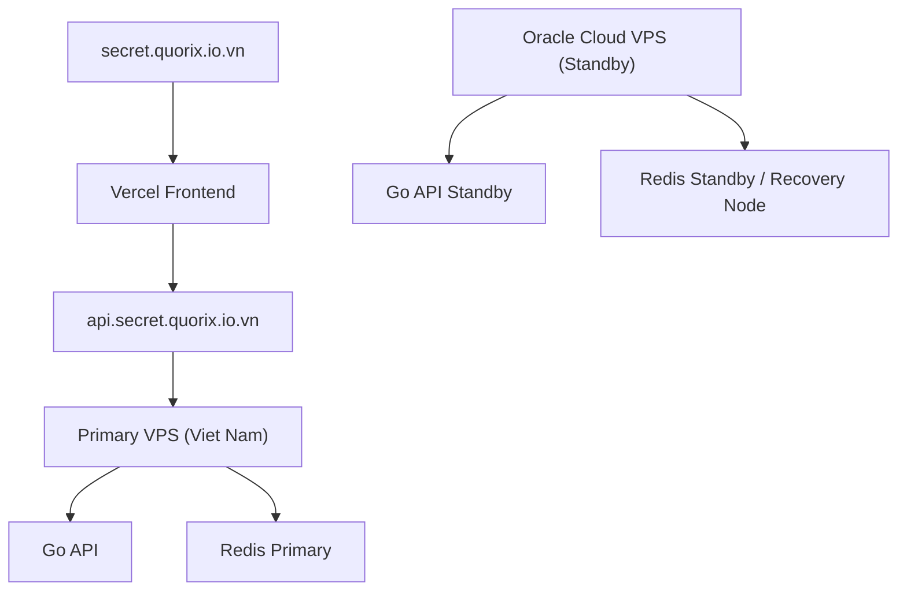

# Provider Selection Guide Cho One Time Link

## 1. Muc tieu cua tai lieu nay

Tai lieu nay giup ban chon ha tang cho `one-time-link` theo cach thuc dung va tiet kiem, khong bi cuon vao viec so sanh VPS theo kieu cam tinh.

Nó duoc viet theo boi canh cu the cua ban:

- du an dung de dua vao portfolio
- ngan sach han che
- muon deploy that tren domain ca nhan
- muon hoc them ha tang
- dang can nhac dung ca:
  - `1 VPS` tu nha cung cap o Viet Nam
  - `1 Oracle Cloud VPS` de du phong va hoc them

## 2. Ket luan nhanh

Neu ban dung ca hai, mo hinh hop ly nhat o giai doan dau la:

- `VPS Viet Nam` = `primary`
- `Oracle Cloud VPS` = `standby` hoac `warm backup`

Khong nen bat dau bang `active-active`.

## 3. Tai sao khong nen active-active ngay?

### Ly do ky thuat

`one-time-link` co bai toan nhay cam ve:

- one-time consume
- TTL
- preview bot protection
- race condition

Neu ban chay `active-active` tren 2 VPS voi 2 Redis rieng ma khong co co che dong bo rat ky, ban se gap rui ro:

- secret duoc tao o node A nhung node B khong co
- reveal o node khac mat trang thai
- duplicate consume
- state `used` va `expired` khong dong nhat

### Ly do van hanh

- phuc tap hon rat nhieu
- ton cong dong bo du lieu va health checks
- kho debug hon khi co loi
- khong xung voi muc tieu portfolio MVP

### Ket luan

Neu muon co them tinh san sang va hoc them ha tang, ban nen di theo:

- `primary + standby`

Thay vi:

- `active-active`

## 4. Kien truc de xuat voi 2 provider

## 5. Vai tro tung provider

## 5.1 VPS nha cung cap o Viet Nam

Day nen la node chinh.

### Ly do

- latency tot hon cho nguoi dung o Viet Nam
- de thanh toan
- de lien he support
- de dat ky vong uptime theo nhu cau portfolio
- thuong hop ly hon cho production public lau dai so voi trial/free tier

### Day la noi nen chay

- backend API chinh
- Redis chinh
- reverse proxy chinh

## 5.2 Oracle Cloud VPS

Day nen la node du phong.

### Ly do

- giup ban hoc them Oracle Cloud
- giam phu thuoc vao 1 nha cung cap
- co the dung de test recovery va runbook
- co the tan dung Free Tier neu account va region hop le

### Day la noi nen chay

- app standby
- Redis standby hoac may test restore
- monitoring hoac script backup/restore

## 6. Nha cung cap nao tot hon cho vai tro chinh?

### Vai tro production primary

Uu tien:

- VPS tra phi o Viet Nam hoac quoc te gia re nhung on dinh

### Vai tro hoc tap, failover, backup

Uu tien:

- Oracle Cloud VPS

### Ly do

Provider chinh nen la noi:

- de doan chi phi
- de giu on dinh
- it bat ngo nhat

Provider du phong co the uu tien:

- hoc he thong
- thu recovery
- danh gia tinh kha dung

## 7. Tieu chi chon VPS Viet Nam

Khi so sanh nha cung cap o Viet Nam, dung checklist nay:

### 7.1 Gia

Can xem:

- gia theo thang
- gia da gom VAT chua
- co phi setup khong
- co phi IP rieng khong

### 7.2 Tai nguyen that

Can xem:

- RAM bao nhieu
- CPU shared hay dedicated
- SSD/NVMe hay HDD
- co gioi han IOPS khong

### 7.3 Mang

Can xem:

- bang thong trong nuoc va quoc te
- co gioi han traffic khong
- route den nguoi dung Viet Nam co on khong

### 7.4 Ho tro ky thuat

Can xem:

- co ticket 24/7 khong
- toc do phan hoi
- co ho tro reset rescue console khong

### 7.5 Tinh nang van hanh

Can xem:

- snapshot
- backup
- firewall
- reverse DNS
- monitoring co ban

### 7.6 Muc de dung

Can xem:

- giao dien co de dung khong
- tao VPS nhanh khong
- co console web khong

## 8. Tieu chi chon Oracle Cloud node du phong

Oracle Cloud phu hop neu ban dat no o vai tro du phong.

### Can kiem tra

- region con tao duoc VM khong
- loai instance free co san khong
- ARM hay AMD co hop voi binary cua ban khong
- IP public co de gan khong
- volume va backup free du den dau

### Luu y quan trong

Free Tier khong nen la noi ban dat niem tin duy nhat cho production.

No tot cho:

- standby
- lab
- recovery drill
- noi hoc them cloud

No khong nen la noi duy nhat cho:

- production public quan trong

## 9. Cach phan vai de xuat

## Phuong an A: Rat gon va hop ly

- `Primary`: VPS Viet Nam
- `Standby`: Oracle Cloud VPS
- `Failover`: bang tay

### Ly do

- de lam
- de hoc
- re
- dung du cho portfolio

## Phuong an B: Tot hon mot chut

- `Primary`: VPS Viet Nam
- `Standby`: Oracle Cloud VPS
- dong bo source code, env template, Caddy config, systemd config
- backup Redis metadata dinh ky neu can
- test failover hang thang

### Ly do

- tang do san sang thuc te
- van khong qua phuc tap

## Phuong an C: Qua tam cho giai doan nay

- active-active
- DNS failover tu dong
- multi-Redis sync phuc tap
- health-check phan tan

### Ly do khong khuyen nghi

- chi phi thoi gian qua cao
- rui ro bug nghiep vu cao hon loi ich

## 10. Backup o day nen hieu the nao?

Voi du an nay, `backup` nen duoc hieu theo 3 lop:

### 10.1 Backup ha tang

- Caddyfile
- systemd units
- env templates
- deployment scripts

### 10.2 Backup source code

- Git remote
- branch ro rang

### 10.3 Backup du lieu runtime

Can can nhac ky.

Ly do:

- secret la du lieu ngan han
- backup secret co the tang do phuc tap
- muc tieu chinh la khong lo secret, khong phai luu lau secret

Khuyen nghi:

- khong uu tien backup ciphertext cho MVP
- uu tien backup cau hinh va kha nang rebuild he thong nhanh

## 11. Tang tinh san sang theo cach thuc dung

Neu ban muon "availability" ma khong over-engineer, lam theo thu tu nay:

1. Deploy on dinh tren 1 VPS chinh.
2. Viet script provision lai server nhanh.
3. Dung Oracle Cloud lam standby.
4. Tao quy trinh failover bang tay.
5. Thu failover dinh ky.

### Ly do

Availability khong chi la co 2 server.

No la kha nang:

- nhan ra su co
- chuyen doi
- khoi phuc
- xac minh he thong song lai

Neu khong co runbook va kiem thu failover, 2 server van co the vo dung.

## 12. Runbook failover toi thieu

Neu primary VPS chet:

1. Kiem tra standby Oracle Cloud dang song.
2. Deploy ban build moi nhat len Oracle node neu can.
3. Khoi dong Go API va Redis standby.
4. Chuyen `api.secret.quorix.io.vn` sang IP cua Oracle node.
5. Kiem tra `/healthz`.
6. Kiem tra create va reveal flow.
7. Ghi lai nguyen nhan va cach quay lai primary sau do.

## 13. Bang cham diem nha cung cap

Ban co the cham tung provider theo thang 10:

- Gia
- Do on dinh
- Do tre tu Viet Nam
- De van hanh
- Ho tro ky thuat
- Snapshot/backup
- De hoc them ha tang

Cong thuc de xuat:

- `Tong diem = Gia x 2 + Do on dinh x 3 + Do tre x 2 + De van hanh x 2 + Ho tro x 1`

Ly do:

- voi portfolio, on dinh quan trong hon tiet kiem them 1-2 USD

## 14. Khuyen nghi cuoi cung

Voi boi canh cua ban, minh khuyen:

- `Production primary`: VPS nha cung cap o Viet Nam
- `Recovery/learning standby`: Oracle Cloud VPS

Day la cach ket hop dep vi:

- re
- hop muc tieu portfolio
- latency dep cho nguoi dung Viet Nam
- van hoc duoc cloud
- co them trai nghiem ve recovery va multi-provider

## 15. Dieu khong nen lam o giai doan nay

- khong can Kubernetes
- khong can active-active
- khong can managed multi-region Redis
- khong can tu dong hoa failover qua som

Neu ban lam qua nhieu, recruiter co the thay ban biet nhieu cong nghe, nhung lai kho thay kha nang uu tien dung bai toan. O giai doan nay, uu tien tot nhat la:

- bai toan dung
- app chay that
- deploy that
- co runbook
- giai thich duoc tai sao chon kien truc do
