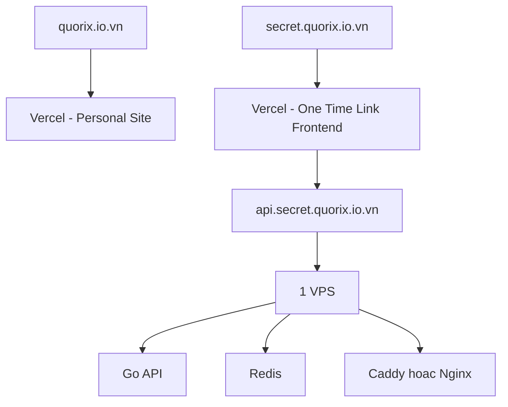

# Deployment Plan Sieu Re Cho quorix.io.vn

## 1. Boi canh hien tai

- Website ca nhan `quorix.io.vn` dang duoc build bang Hugo + PaperMod
- Website ca nhan dang deploy tren Vercel
- Domain duoc dang ky qua PA Viet Nam
- Muc tieu cua `one-time-link` la:
  - bo sung vao portfolio
  - tang brand ca nhan
  - co san pham that de recruiter xem
  - giu chi phi van hanh rat thap

## 2. Ket luan ngan

Phuong an re nhat va hop ly nhat o thoi diem hien tai la:

- giu `quorix.io.vn` nhu hien tai tren Vercel
- tao mot frontend project rieng cho `one-time-link` tren Vercel
- dung subdomain rieng, de xuat `secret.quorix.io.vn`
- dung `api.secret.quorix.io.vn` tro toi 1 VPS nho
- chay backend Go + Redis tren cung 1 VPS

## 3. Chi phi co chi ton cho VPS khong?

### Cau tra loi ngan

Gan nhu dung, nhung khong phai luc nao cung chi co VPS.

### Ly do

Trong truong hop cu the cua ban, chi phi bat buoc tang them luc dau gan nhu chi la VPS, boi vi:

- domain `quorix.io.vn` ban da so huu roi
- website ca nhan da chay tren Vercel
- frontend one-time-link co the dung Vercel Hobby
- TLS co the lay mien phi qua Vercel va Let''s Encrypt

### Nhung khoan co the phat sinh sau nay

- backup VPS
- snapshot VPS
- monitoring tra phi
- email transactional neu sau nay muon gui link qua email
- bot protection nang cao
- managed Redis neu ban khong muon tu van hanh Redis

### Ket luan thuc te

Voi MVP portfolio, chi phi tang them chu yeu la:

- `1 VPS`

Con cac chi phi khac co the de o muc `0` trong giai doan dau.

## 4. Tai sao khong nen dung chung voi website Hugo hien tai?

Co the dung chung domain goc, nhung khong nen dung chung app.

### Ly do

- `quorix.io.vn` hien la website noi dung tinh
- `one-time-link` la ung dung web co state, API, Redis, va backend runtime
- tach subdomain se de deploy hon, de debug hon, de giai thich hon khi recruiter hoi

### Cach tach de xuat

- `quorix.io.vn`: website ca nhan Hugo/PaperMod
- `secret.quorix.io.vn`: frontend one-time-link
- `api.secret.quorix.io.vn`: backend API

## 5. Kien truc deploy re nhat

## 6. Thanh phan nen dung

### 6.1 Frontend

- React + TypeScript
- deploy tren Vercel

### Ly do

- ban da co san he thong voi Vercel
- frontend one-time-link can xu ly client-side encryption
- Vercel rat hop cho static frontend va workflow portfolio

### 6.2 Backend

- 1 binary Go trong giai doan dau
- chua tach microservices deploy doc lap

### Ly do

- re nhat
- de van hanh nhat
- van giu duoc logic boundary sach trong codebase

### 6.3 Data store

- Redis self-host tren cung VPS

### Ly do

- TTL rat hop voi bai toan
- atomic consume hop voi bai toan one-time reveal
- tu host Redis re hon managed Redis rat nhieu

## 7. Lua chon VPS: tra phi re hay free tier/trial?

## 7.1 Lua chon A: VPS re tra phi

### Uu diem

- on dinh hon cho website cong khai
- de du doan chi phi
- khong phu thuoc vao credit het han
- it nguy co bi khoa dich vu do het trial
- de gan domain va van hanh lau dai

### Nhuoc diem

- phai tra tien hang thang

### Khi nao nen chon

- khi muc tieu la portfolio public thuc su
- khi ban muon recruiter co the vao xem bat ky luc nao

## 7.2 Lua chon B: Free tier hoac trial cloud lon

### Uu diem

- co the rat re hoac tam thoi mien phi
- hoc duoc them cloud ecosystem

### Nhuoc diem

- nhieu chuong trinh la `trial`, khong phai mien phi vinh vien
- can credit card hoac xac minh thanh toan
- gioi han region, CPU, RAM, bang thong, hoac thoi gian su dung
- sau khi het credit/trial, dich vu co the ngung neu ban khong nang cap
- co kha nang phuc tap hon VPS re tuyen tinh

### Ket luan

Free tier phu hop cho:

- hoc cloud
- demo ngan han
- test thu he thong

Free tier khong phai luc nao cung la lua chon tot nhat cho:

- website public on dinh de dua vao portfolio

## 8. Nhan xet tung nhom nha cung cap

## 8.1 Nha cung cap VPS re

Bao gom:

- nha cung cap Viet Nam gia re
- Hetzner
- DigitalOcean
- Vultr
- Linode/Akamai

### Ly do dang can nhac

- tra tien ro rang hang thang
- de chay Go API + Redis + reverse proxy tren 1 may
- hop voi bai toan nho, traffic ban dau thap

### Danh gia cho du an nay

Day la nhom phu hop nhat.

Neu ban uu tien:

- gia re nhat: co the nghieng ve VPS re trong nuoc hoac Hetzner
- de dung, tai lieu nhieu, latency quen thuoc: DigitalOcean cung rat on, nhung thuong dat hon mot chut

## 8.2 Google Cloud

Theo tai lieu chinh thuc, Google Cloud co:

- Free Trial
- Compute Engine Free Tier voi `1 e2-micro VM` moi thang, nhung chi ap dung o mot so region My, kem gioi han disk va egress

Nguon:

- [Google Cloud Compute Engine free features](https://cloud.google.com/free/docs/compute-getting-started)
- [Google Cloud Free Program](https://cloud.google.com/free/docs/gcp-free-tier)

### Danh gia cho du an nay

Khong phai lua chon toi uu cho portfolio website cua ban, vi:

- region free tier bi gioi han
- neu nguoi dung o Viet Nam thi latency khong dep
- quan tri cloud se nang hon mot VPS re don gian

## 8.3 AWS

Theo thong bao cua AWS, Free Tier hien co mo hinh credit moi:

- new customers co the nhan toi `200 USD credits`
- free account plan het han sau `6 thang` hoac khi dung het credit

Nguon:

- [AWS Free Tier](https://aws.amazon.com/free/)
- [AWS credit update, July 16 2025](https://aws.amazon.com/about-aws/whats-new/2025/07/aws-free-tier-credits-month-free-plan/)

### Danh gia cho du an nay

Khong nen chon AWS cho phuong an re nhat cua du an nay, vi:

- de phat sinh chi phi neu quan ly khong ky
- mo hinh billing va mang cua AWS de lam ban ton suc hon muc can thiet
- trial/credit khong phai la nen tang tot cho san pham portfolio can ton tai on dinh lau hon

## 8.4 Azure

Theo tai lieu chinh thuc, Azure free account hien co:

- `200 USD credit` dung trong `30 ngay`
- mot so free services trong `12 thang` cho khach hang moi
- mot so always-free services

Nguon:

- [Azure free account](https://azure.microsoft.com/Free)
- [Azure free services](https://azure.microsoft.com/en-us/pricing/free-services/)

### Danh gia cho du an nay

Azure cung khong phai lua chon re nhat va gon nhat cho bai toan nay, vi:

- trial ngan
- billing phuc tap hon nhu cau thuc te cua du an
- khong tao loi ich ro rang hon so voi 1 VPS nho

## 8.5 Oracle Cloud

Theo tai lieu chinh thuc, Oracle Cloud Free Tier co:

- `300 USD` free trial credit trong `30 ngay`
- Always Free services
- compute Always Free, bao gom AMD-based VM va Ampere A1 resources trong gioi han cho phep

Nguon:

- [Oracle Cloud Free Tier](https://www.oracle.com/cloud/free/)
- [Oracle Always Free resources](https://docs.oracle.com/iaas/Content/FreeTier/resourceref.htm)

### Danh gia cho du an nay

Day la lua chon free tier dang can nhac nhat neu ban thuc su muon toi uu chi phi den muc gan 0.

Nhung van co ly do de can than:

- tai nguyen free co the khan hiem theo region
- khong phai luc nao tao account cung truot ma
- van la moi truong cloud co them do phuc tap van hanh

### Ket luan

Neu ban muon thu free nghiem tuc nhat, OCI la lua chon dang thu nhat.

Neu ban muon on dinh, don gian, de giai thich voi recruiter, 1 VPS re van la lua chon dep hon.

## 9. Khuyen nghi cu the cho ban

Voi muc tieu:

- it tien
- can public lau dai
- can dep cho portfolio
- can de van hanh

Minh khuyen:

1. Giu `quorix.io.vn` tren Vercel nhu hien tai.
2. Tao `secret.quorix.io.vn` cho frontend one-time-link tren Vercel.
3. Tao `api.secret.quorix.io.vn` tro toi 1 VPS nho.
4. Chay `Go API + Redis + Caddy` tren cung VPS.
5. Chua dung managed Redis.
6. Chua tach microservices thanh nhieu may.

## 10. Uoc tinh chi phi

### Phuong an toi thieu thuc te

- website ca nhan: `0 USD` tang them
- frontend one-time-link tren Vercel Hobby: `0 USD` tang them
- domain: `0 USD` tang them vi ban da co san
- backend + Redis: `1 VPS`

Tong tang them:

- chu yeu la tien `VPS`

### Muc thuc te de nhin

Neu dung VPS re:

- khoang `5-10 USD/thang` la muc rat hop ly de chay MVP public

### Muc co the xuong thap hon

- co the gan `0 USD/thang` neu dung free tier thanh cong

Nhung ly do minh khong xem day la phuong an chinh:

- khong on dinh bang
- co gioi han
- co kha nang bi gian doan
- khong dep bang cho website portfolio can song lau

## 11. Tai sao phuong an nay hop voi portfolio

- recruiter co the vao bang domain rieng cua ban
- co website that, API that, deployment that
- van the hien duoc tu duy system design va security
- khong ton qua nhieu tien de duy tri

## 12. Deployment checklist de xuat

### DNS

- giu `quorix.io.vn` tren Vercel
- tao `CNAME` cho `secret.quorix.io.vn` theo huong dan Vercel
- tao `A record` cho `api.secret.quorix.io.vn` tro toi IP VPS

### VPS

- cai Go binary
- cai Redis
- cai Caddy hoac Nginx
- mo cong `80/443`
- khoa Redis o localhost
- dung SSH key, khong dung password

### Frontend

- dat `VITE_API_BASE_URL=https://api.secret.quorix.io.vn`
- gioi han CORS chi cho `https://secret.quorix.io.vn`

### Production basics

- health endpoint
- structured logs
- request size limits
- basic rate limiting
- backup toi thieu cho file cau hinh va script deploy

## 13. Ket luan cuoi

Neu chi tinh giai doan dau cua du an nay, nhan dinh dung nhat la:

- chi phi tang them gan nhu chu yeu la `VPS`

Nhung neu hoi ky hon thi:

- dung, `VPS` la chi phi chinh
- khong, no khong phai chi phi duy nhat trong moi tinh huong
- cac khoan khac hien tai co the giu o muc `0` hoac gan `0`

Lua chon de xuat cuoi cung:

- `Vercel` cho frontend
- `1 VPS nho` cho Go + Redis
- `PA Viet Nam` giu domain nhu hien tai
- `secret.quorix.io.vn` cho san pham

Day la phuong an can bang tot nhat giua:

- re
- dep
- de van hanh
- de dua vao portfolio
