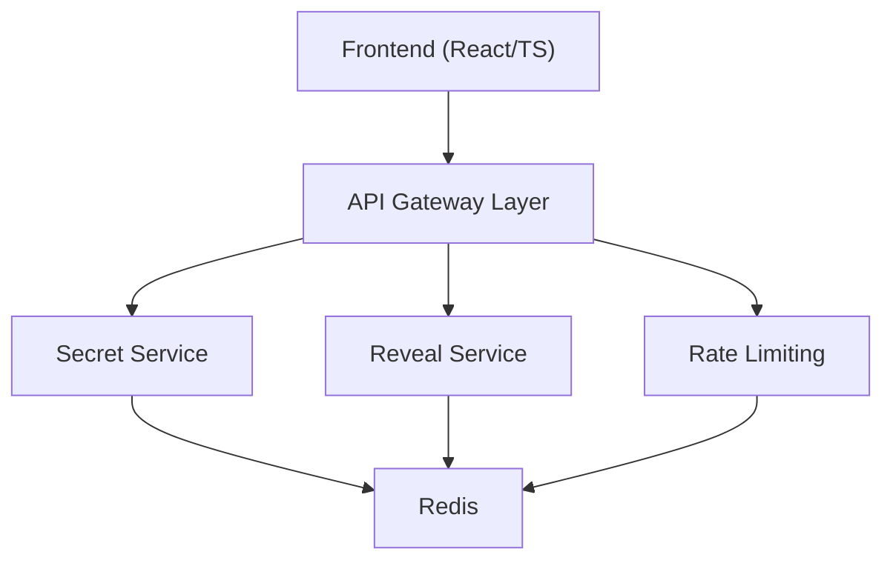
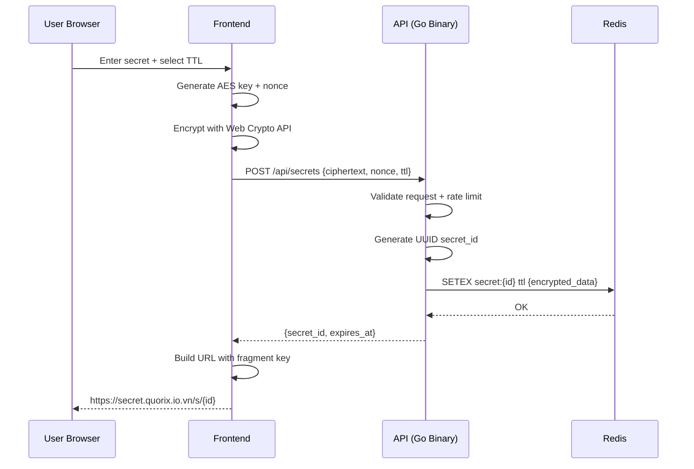
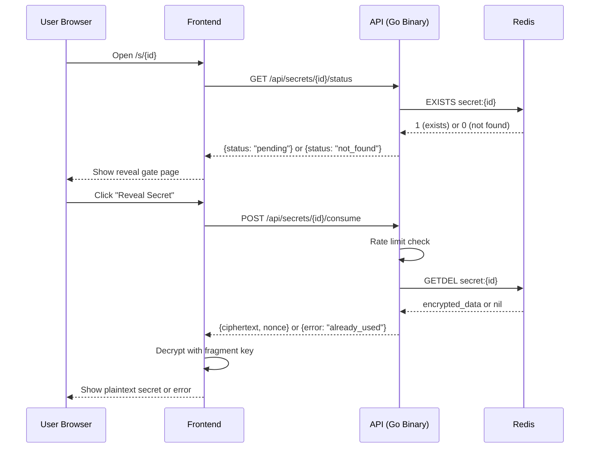
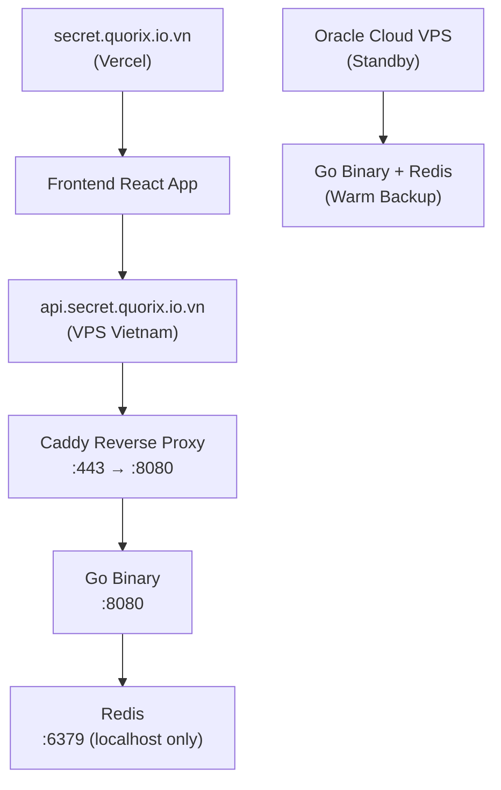

# One-Time Link Architecture

## 1. Architecture Philosophy

The target architecture defines clear service boundaries for future microservices evolution, but the MVP deployment uses a monolithic approach for simplicity and cost-effectiveness.

**Key Principles:**
- **Boundary-first design**: Code is organized into distinct service domains
- **Deployment flexibility**: Same codebase can run as monolith or separate services
- **Portfolio-focused**: Optimized for demonstration and learning, not enterprise scale
- **Cost-conscious**: Single VPS deployment with optional standby for learning

## 2. Technology Stack

### Frontend
- **Framework**: React 18 with TypeScript
- **Build Tool**: Vite for fast development and optimized builds
- **Crypto**: Web Crypto API for AES-GCM encryption
- **Deployment**: Vercel (leveraging existing `quorix.io.vn` setup)

### Backend
- **Language**: Go 1.21+
- **HTTP**: Standard `net/http` with `chi` router for middleware
- **Architecture**: Single binary with internal service boundaries
- **Deployment**: Single VPS with systemd service management

### Data Storage
- **Primary**: Redis 7+ for secrets and session storage
- **Rationale**: Built-in TTL, atomic operations (GETDEL), high performance
- **Deployment**: Self-hosted on same VPS as backend

### Infrastructure
- **Primary**: Vietnamese VPS provider for low latency
- **Standby**: Oracle Cloud VPS for failover and learning
- **Proxy**: Caddy for automatic HTTPS and reverse proxy
- **DNS**: Managed through PA Vietnam (existing domain setup)

## 3. Service Boundaries (Logical Architecture)

The codebase is organized into logical service boundaries that can be deployed as a monolith initially, then split into separate services later.



### 3.1 Frontend Service
**Responsibilities:**
- Render create and reveal pages
- Generate AES-GCM keys and nonces
- Encrypt plaintext before transmission
- Decrypt ciphertext after successful reveal
- Manage URL fragment keys (never send to server)

**Technology:** React + TypeScript, deployed on Vercel

### 3.2 API Gateway Layer
**Responsibilities:**
- Public API endpoint consolidation
- Request validation and size limits
- CORS policy enforcement
- Request ID generation and logging
- Route requests to internal service logic

**Implementation:** HTTP middleware in Go binary

### 3.3 Secret Service (Internal)
**Responsibilities:**
- Store encrypted secrets with TTL
- Generate unique secret IDs (UUID v4)
- Provide secret status without revealing content
- Atomic secret consumption via Redis GETDEL

**Implementation:** Go package `internal/secret`

### 3.4 Reveal Service (Internal)
**Responsibilities:**
- Manage reveal session lifecycle
- Enforce interaction gate policy
- Coordinate with Secret Service for consumption
- Handle reveal state transitions

**Implementation:** Go package `internal/reveal`

### 3.5 Rate Limiting (Internal)
**Responsibilities:**
- IP-based rate limiting (10 creates/hour, 20 reveals/hour)
- User-Agent pattern detection
- Suspicious activity logging
- Request throttling and rejection

**Implementation:** Go middleware with Redis counters

## 4. Data Models

### 4.1 Secret Record (Redis)

**Key Pattern:** `secret:{uuid}`
**TTL:** Set to user-selected expiration (3600, 86400, or 604800 seconds)

```json
{
  "ciphertext": "base64-encoded-encrypted-data",
  "nonce": "base64-encoded-96-bit-nonce", 
  "algorithm": "AES-GCM",
  "created_at": "2026-04-05T12:00:00Z",
  "max_views": 1
}
```

**Storage Implementation:**
- Use Redis `SETEX` for atomic set-with-TTL
- Use Redis `GETDEL` for atomic consume
- No separate expiration tracking needed (Redis TTL handles cleanup)

### 4.2 Rate Limiting Counters (Redis)

**Key Patterns:**
- `rate_limit:create:{ip_hash}` - TTL: 3600 seconds
- `rate_limit:reveal:{ip_hash}` - TTL: 3600 seconds

**Value:** Integer counter, incremented with `INCR`

### 4.3 Request Logging (Structured Logs)

**Log Format:** JSON with fields:
- `timestamp`, `level`, `message`
- `request_id`, `ip_hash`, `user_agent_hash`
- `action` (create/reveal/status), `secret_id`, `result`
- **Never logged:** plaintext secrets, fragment keys, full IP addresses

## 5. Request Flows

### 5.1 Create Secret Flow



### 5.2 Reveal Secret Flow



### 5.3 Error Handling Flow

**Expired Secret:**
- Redis TTL expires → key no longer exists
- Status check returns `not_found`
- Frontend shows "This secret has expired"

**Already Used:**
- First consume succeeds, returns ciphertext
- Subsequent consumes find no key (GETDEL removed it)
- Returns `already_used` error

**Invalid Fragment Key:**
- Server returns valid ciphertext
- Browser decryption fails
- Frontend shows "Invalid link or corrupted data"

## 6. Deployment Architecture

### 6.1 MVP Deployment (Single VPS)



**Production Setup:**
- **Frontend**: Deployed on Vercel, domain `secret.quorix.io.vn`
- **Backend**: Single Go binary on Vietnamese VPS
- **Database**: Redis on same VPS, bound to localhost
- **Proxy**: Caddy for automatic HTTPS and reverse proxy
- **Failover**: Manual DNS switch to Oracle Cloud standby

### 6.2 Service Evolution Path

**Phase 1 (MVP):** Single binary deployment
- All service logic in one Go process
- Internal package boundaries maintained
- Shared Redis instance

**Phase 2 (Growth):** Horizontal scaling
- Multiple instances of same binary behind load balancer
- Shared Redis cluster
- Session affinity not required (stateless design)

**Phase 3 (Microservices):** Service separation
- Extract services into separate binaries
- Service-to-service HTTP communication
- Independent scaling and deployment

### 6.3 Infrastructure Requirements

**Minimum VPS Specifications:**
- **CPU**: 1 vCPU (shared acceptable for MVP)
- **RAM**: 1GB (Redis + Go binary + OS)
- **Storage**: 20GB SSD (logs, binaries, Redis persistence)
- **Network**: 1TB/month bandwidth (generous for text-only secrets)
- **OS**: Ubuntu 22.04 LTS or Debian 12

**Network Configuration:**
- **Ports**: 22 (SSH), 80 (HTTP redirect), 443 (HTTPS)
- **Firewall**: UFW with default deny, allow SSH/HTTP/HTTPS
- **Redis**: Bind to 127.0.0.1:6379 only (no external access)

## 8. Suggested repository and service structure

```text
frontend/
  web-app/
backend/
  api-gateway/
  secret-service/
  reveal-service/
  abuse-service/
  ops-worker/
deploy/
  docker-compose.yml
docs/
```

Alternative for learning speed:

- keep one repository
- one Go module for all backend services
- separate binaries under `cmd/`

This gives you microservice boundaries without forcing a multi-repo setup too early.

## 9. API sketch

### Public endpoints through API Gateway

- `POST /api/secrets`
- `GET /api/secrets/{id}/status`
- `POST /api/reveal-sessions`
- `POST /api/secrets/{id}/consume`
- `GET /healthz`

### Internal service responsibilities

- Secret Service: create, status, atomic consume
- Reveal Service: create reveal session, validate session, orchestrate consume
- Abuse Service: evaluate risk and rate limit decisions

## 10. Operational concerns

### Logs

- structured JSON logs
- request IDs
- never log ciphertext length together with identifiable metadata in a way that weakens privacy more than necessary

### Metrics

- secrets created
- successful reveals
- already used responses
- expired responses
- blocked requests
- reveal session creation failures

### Deployment

- local: Docker Compose with Redis and all services
- production: containerized services behind HTTPS reverse proxy or ingress

## 11. Testing strategy

### Frontend

- unit tests for crypto helpers and payload serialization
- component tests for create and reveal flows
- end-to-end tests for link states

### Backend

- unit tests for request validation and service rules
- integration tests against Redis for TTL and atomic consume
- race-focused tests around concurrent reveal attempts

### End-to-end

- create -> share -> reveal exactly once
- preview visit does not consume
- expired secret returns correct state
- wrong fragment key cannot decrypt the payload
